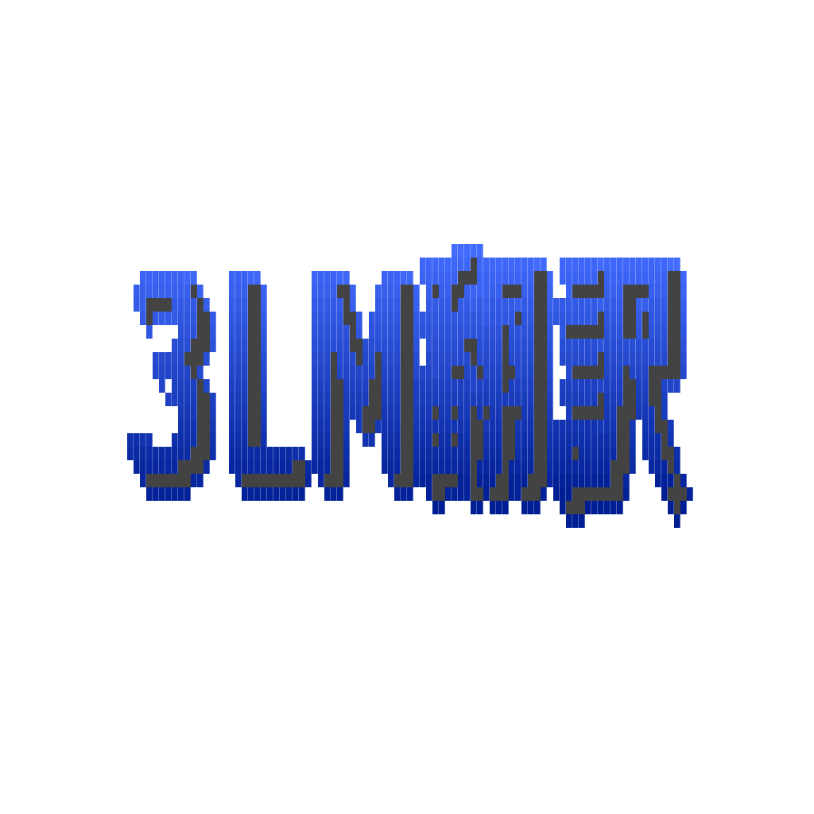

# 3LMTranslater

<p align="center">
  
</p>

[日本語](#日本語) | [English](#english)

---

## 日本語

3LMTranslaterは、Rust (egui) と Python を組み合わせた、プライバシー重視のローカルAI翻訳アプリケーションです。
llama-cpp-python を介して GGUF モデルをロードし、お使いの PC 上で直接翻訳を実行します。

### 主な機能
*   **オフライン翻訳**: 外部サーバーへデータを送ることなく、GGUF モデルを用いたセキュアな翻訳が可能。
*   **多言語 TTS (音声合成)**: Kokoro-82M および espeak-ng を活用し、日本語、英語、中国語、スペイン語等の多言語再生に対応。
*   **柔軟なカスタマイズ**: システムプロンプトや推論パラメータを UI から直接調整可能。
*   **クロスプラットフォーム**: Windows および macOS で動作（ソースからのビルドが必要）。

### セットアップ
1.  **espeak-ng のインストール**:
    多言語音声合成に必須です。
    *   **Windows**: [espeak-ng GitHub](https://github.com/espeak-ng/espeak-ng/releases) からインストーラーをダウンロード。
    *   **macOS**: 
    ```
    brew install espeak
    ```
1.  **Python 依存関係の導入**:
    ```
    pip install -r requirements.txt
    ```
2.  **ビルド**:
    ```
    cargo build --release
    ```

### ライセンス
本プロジェクトは **GPL-3.0** ライセンスです。
詳細は `LICENSE` および `NOTICE.md` を参照してください。

### 注意事項
本アプリの音声合成機能は現状「おまけ」としての位置付けであり、Kokoro-82M モデルにのみ対応しています。 その他の TTS エンジンには対応しておりませんのでご了承ください。

---

## English

3LMTranslater is a privacy-focused local AI translation application built with Rust (egui) and Python.
It loads GGUF models via llama-cpp-python to perform translations directly on your machine.

### Features
*   **Offline Translation**: Securely translate text using GGUF models without sending data to external servers.
*   **Multi-language TTS**: Supports audio playback in languages such as Japanese, English, Chinese, and Spanish using Kokoro-82M and espeak-ng.
*   **Customizable**: Directly adjust system prompts and inference parameters via the UI.
*   **Cross-Platform**: Run on Windows and macOS (Build from source).

### Setup
1.  **Install espeak-ng**:
    Required for multi-language TTS.
    *   **Windows**: Download from [espeak-ng GitHub](https://github.com/espeak-ng/espeak-ng/releases).
    *   **macOS**: 
    ```
    brew install espeak
    ```
2.  **Install Python Dependencies**:
    ```
    pip install -r requirements.txt
    ```
3.  **Build**:
    ```
    cargo build --release
    ```

### License
This project is licensed under **GPL-3.0**.
See `LICENSE` and `NOTICE.md` for more details.

### Features
The Text-to-Speech (TTS) feature is currently considered a secondary "bonus" feature and strictly supports the Kokoro-82M model only. Please note that other TTS engines are not supported at this time.